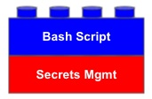

# Prisma Cloud API Tutorial - Part 1
   
**Learn how to securely automate tasks with the Prisma Cloud API**

This lab uses one of our [Secrets Management tool building blocks].   I'm choosing to use Vault in 'Dev' mode for this tutorial, however because these labs are written in a modular fashion, you can swap out for another Secrets Management method if you desire.  


## Objectives:
1. Create a bash script to automate requests with the Prisma Cloud API
2. Utilize jq for processing and filtering JSON data retreived from Prisma Cloud
3. Utilize a Secrets Managment tool to store and retreive Access Keys


## 0 - Prerequisites:
- access to a Prisma Cloud tenant
- terminal shell (i.e. bash or zsh)
- install [Vault](https://learn.hashicorp.com/tutorials/vault/getting-started-install?in=vault/getting-started)
- install [jq](https://stedolan.github.io/jq/download/)
- Obtain Values for the following keys:

| **Key** | **Value** | **How To Obtain** |
| ------------------ | --------------------- | ---------------- |
| **pcee_api_url** | **'https://<YOUR_TENANT_API_URL>'** | *Visit [Prisma PAN API Docs](https://prisma.pan.dev/api/cloud/api-urls) to map your tenant URL to the tenant API URL.* |
| **pcee_accesskey** | **'<YOUR_ACCESS_KEY>'** | *Log into Prisma Cloud and go to Settings > Access Keys* |
| **pcee_secretkey** | **'<YOUR_SECRET_KEY>'** | *Obtain your Secret Key at time of Access Key creation.* |

## 1 - Setup Secrets Management 

I'm choosing to Create Secret and store Access Key info in Vault in Dev mode.
   
Feel free to choose another Secrets Management option.  
TODO: Refer to other options.
   
   
*NOTE: Using Vault in **'Dev'** mode is NOT recommended for production use, however much simplier to learn and use for the purposes of this tutorial.  See [Deploy Vault Tutorial](https://learn.hashicorp.com/tutorials/vault/getting-started-deploy?in=vault/getting-started) and [Seal/Unseal Concepts](https://www.vaultproject.io/docs/concepts/seal) to learn how to use Vault for a production environment.*
   

Using dev mode, start the dev server:
```
vault server -dev
```

Before proceeding, suggest to review and consider [Keeping your secrets out of your Bash History](../secrets-mgmt/Keeping_Secrets_Out_Of_Bash_History.md
)
   
Launch a new terminal window and Copy the `export VAULT_ADDR ...` command from the first terminal output and run in the second terminal window.  
   
> **Example:**
```
export VAULT_ADDR='http://127.0.0.1:8200'
```

Save the unseal key somewhere. Don't worry about how to save this securely. For now, just save it anywhere.

Set the `VAULT_TOKEN` environment variable value to the generated **Root Token** value displayed in the terminal output.   
   
> **Example:**
```
export VAULT_TOKEN='s.XmpNPoi9sRhYtdKHaQhkHP6x'
```
   
To verify the server is running:
```
vault status
```

Using your Prisma Cloud key/values, create the secret with the three pieces of key/value data (replacing the '\<TEXT>' of each value with your values):
In your terminal:

```bash
vault kv put secret/prisma_enterprise_env \
             pcee_api_url='https://<YOUR_TENANT_API_URL>' \
             pcee_accesskey='<YOUR_ACCESS_KEY>' \
             pcee_secretkey='<YOUR_SECRET_KEY>'
```
